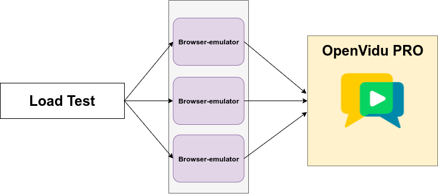
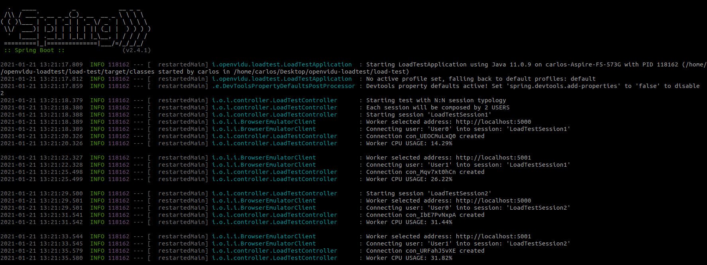
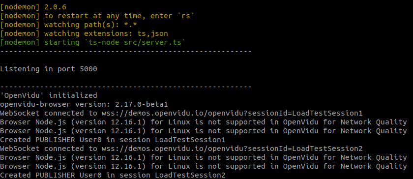
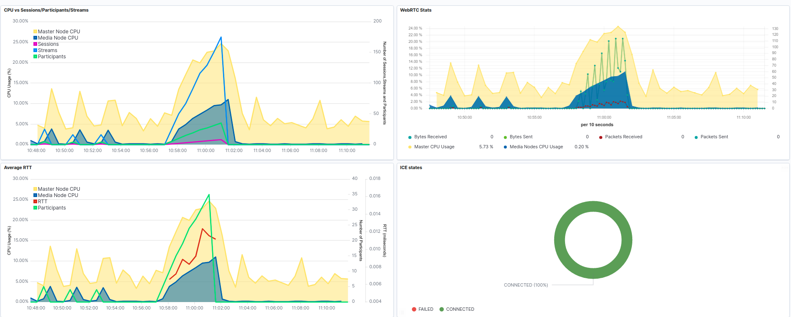

# OpenVidu Load Test

> WARNING: The current tool is under development which means that bugs could be present in the code and you can expect some changes in usage.

This repository contains a distributed tool that allows you to perform a load test against an OpenVidu CE or an OpenVidu PRO deployment.

Take into account that you must to deploy OpenVidu platform before using this tool.

<br>

# **Table of Contents**
1. [Project Architecture](#project-architecture)
2. [Usage instructions](#usage-instructions)
3. [Sample test execution](#sample-test-execution)
4. [Analyze test results](#analyze-test-results)
5. [Browser Emulator documentation](#browser-emulator-documentation)

<hr>

## **Project Architecture**



* [**Browser-emulator**](#browser-emulator): Worker service implemented in NodeJS and controlled with a REST protocol that capable of connecting to an OpenVidu session and sending and receiving WebRTC media using openvidu-browser library.
The browser-emulator service provides several connection modes:

	+ **Traditional mode**: It is able to start and launch **containerized Chrome browsers** using Docker and Selenium emulating a fully real user.

	+ **Emulated mode**: It is capable to emulate a user connection without use a browser:
		+ Overriding a WebRTC API using [node-webrtc library](https://github.com/node-webrtc/node-webrtc) and getting the media from a canvas publishing a moving image.
		+ ~~Overriding a WebRTC API using [node-webrtc library](https://github.com/node-webrtc/node-webrtc) and getting the media from a **video file** using ffmpeg.~~
		+ Overriding the peerConnection objects using [Kurento](https://www.kurento.org/) and getting the media from a video file.

* [**Loadtest Controller**](#loadtest-controller): Controller service in charge of the coordination of the browser-emulator workers. It read the load test scenario from a file and control the browser-emulator workers to connect participants loading OpenVidu platform.

## **Usage Instructions**

These instructions assume that OpenVidu CE or PRO is already deployed. See [how deploy OpenVidu PRO](https://docs.openvidu.io/en/stable/openvidu-pro/#how).

### 1. Launch workers

<details>
  <summary><strong>For testing locally</strong></summary>

<br>

>This instructions assume you are using a **linux system**. Windows and Mac can require some adaptation.

<br>
To start with the load test you will have to start a worker first and the execute the controller.


In the machines where you want to execute the workers you need to have **NodeJS** and **Docker** platform installed.

Then follow these steps:

- **Clone this repository**

```bash
git clone https://github.com/OpenVidu/openvidu-loadtest.git
```

- **Start browser-emulator service (worker)**

```bash
cd openvidu-loadtest/browser-emulator/
# Assuming that you're in a clean environment, the script will install:
# - NodeJS
# - Docker
# - Ffmpeg
# - Download te required media files for executing the containerized Chrome Browsers
sudo su
./prepare.sh
npm install
npm run start:dev-canvas
```

<!-- **3. Configure the [required loadtest-controller parameters](#Required-parameters) and the [worker ip address](#Development-mode-parameters-for-testing-locally)**. -->

##### Running options
By default, this worker is listening on port `5000` that you have to specify later in the controller configuration. If you want to run it on another port just add `SERVER_PORT=port_number` before `npm run start` command:

```bash
SERVER_PORT=6000 npm run start
```

Moreover, the last run command will assign `NODE_WEBRTC` for [emulated user types](browser-emulator/src/types/config.type.ts). You can run the following command for use KMS WebRTC:

```bash
npm run start:dev-kms
```

</details>

<details>
  <summary><strong>For testing on AWS</strong></summary>

<br>
  If you want to launch the load tests in a production environment, you can do that with AWS.


  The browser-emulator services will be launched (**_by the loadtest-controller_**) in EC2 instances with the aim of emulate real users connected to OpenVidu.

**Requirements**
* **Create browser-emulator AMI**:

	Before run the create an AMI, ensure that your AWS credentials are properly configured. You can check it running `aws configure`.

	**Once aws credentials have been configured in your pc**, it's time to create the browser-emulator AMI. For creating it, you only have to run the `createAMI.sh` script.

	```bash
	./browser-emulator/aws/createAMI.sh
	```

	After AMI was created, you must set the  **AMI ID** to [`load-test/src/main/resources/application.properties`](loadtest-controller/src/main/resources/application.properties), in particular `WORKER_AMI_ID` property.

* **Create a security group**:

	The instance which will contain the browser-emulator service **must have** the **5000** _(REST API)_ and **5001** _(WebSocket)_ ports opened. For doing this, **you will have to create a AWS Security Group (SG)** with these requeriments.


	After SG was created, you must set the **security group ID** to [`load-test/src/main/resources/application.properties`](loadtest-controller/src/main/resources/application.properties), in particular `WORKER_SECURITY_GROUP_ID` property.

The *loadtest-controller* will use the BrowserEmulator AMI (previously created) for create instances on demand. All you have to do is fill the [AWS configuration](#AWS-parameters-for-testing-on-AWS) in loadtest-controller properties besides the [required parameters](#Required-parameters)


</details>


### 2. Execute controller

In the machine you want to execute the controller you need to have **Java 11** platform installed.

Then follow these steps:

#### 1. Clone this repository

```bash
git clone https://github.com/OpenVidu/openvidu-loadtest.git
```

#### 2. Configure Loadtest Controller

Running the following command **under project root directory** you will be able to edit the [`load-test/src/main/resources/application.properties`](loadtest-controller/src/main/resources/application.properties) which contains a list of configuration parameters that you will can customize.

```bash
nano loadtest-controller/src/main/resources/application.properties
```

In this file you will see:

#### Required parameters

```properties
# Load Test Parameters (Required)
OPENVIDU_URL=https://openvidu_pro_url
OPENVIDU_SECRET=openvidu_pro_secret
SESSION_NAME_PREFIX=LoadTestSession
USER_NAME_PREFIX =User
SECONDS_TO_WAIT_BETWEEN_PARTICIPANTS=1
SECONDS_TO_WAIT_BETWEEN_SESSIONS=2
SECONDS_TO_WAIT_BEFORE_TEST_FINISHED=10
SECONDS_TO_WAIT_BETWEEN_TEST_CASES=10
```
#### Development mode parameters (only for testing locally)

```properties
# For testing locally, fill it with the worker ip address: 195.166.0.0
WORKER_URL_LIST=
```

#### AWS parameters (only for testing on AWS)

General  AWS parameters

```properties
# For testing on AWS

# For launching EC2 instances and allowing to workers upload recordings to S3 bucket
AWS_ACCESS_KEY=your-aws-key
AWS_SECRET_ACCESS_KEY=your-secret-key
WORKER_AMI_ID=ami-xxxxxxxxxxx
# We recommend c5 type. https://aws.amazon.com/ec2/instance-types/
WORKER_INSTANCE_TYPE=c5.xlarge
# By default, the browser-emulator service is listening on:
# 5000 (REST API)
# 5001 (WebSocket)
# The SG will need these ports opened.
WORKER_SECURITY_GROUP_ID=sg-xxxxxxxxx
WORKER_INSTANCE_REGION=
# Numbers of workers to launch before the test starts
WORKERS_NUMBER_AT_THE_BEGINNING=1
```


##### For the AUTO distribution of participants to workers
```properties
# Overcoming this CPU percentage threshold a new worker will be launched
WORKER_MAX_LOAD=80
# Number of new workers incrementation
WORKERS_RUMP_UP=1
```

##### For the MANUAL distribution of participants to workers
```properties
# Boolean param for MANUAL participants allocation
MANUAL_PARTICIPANTS_ALLOCATION=false
# Number of participants per worker
PARTICIPANTS_PER_WORKER=
```

##### For video quality control
These properties allow record a participant (launching an external chrome browser) for check the received video quality.

When test finishes, it will saved in the S3 Bucket.


```properties
# For video quality control
# If testing on AWS, It'll start a new ec2 instance where a new participant will be connected using a real Chrome Browser
# and it will start to record the session when media node has archieved this value
MEDIANODE_LOAD_FOR_START_RECORDING=0
# it will start to record the sessions gruped by the specifyed value.
# 0: Recording disabled, 1 recording starts each session, 2 recording starts each two session ...
RECORDING_SESSION_GRUPED_BY=0
# Bucket name where the recordings will be saved
# Record each MediaStream in each worker for Quality of Experience analysis
QOE_ANALYSIS=true
S3_BUCKET_NAME=openvidu-loadtest-capacity
```

#### For retrying the participant creation

These properties allow retry the participant creation when it fails
```properties
RETRY_MODE=false
RETRY_TIMES=5
```

#### Monitoring parameters

>WARNING: **The experiments we made have been tested with Elasticsearch 7.8.0 version. A deployment with a different version could cause errors**.

```properties
# Monitoring Parameters (Optional)
ELASTICSEARCH_USERNAME=elasticusername
ELASTICSEARCH_PASSWORD=password
KIBANA_HOST=https://kibanahost
```

| Make sure your OpenVidu Configuration has the following properties for a good monitoring:

- `OPENVIDU_PRO_STATS_MONITORING_INTERVAL=1`
- `OPENVIDU_PRO_STATS_WEBRTC_INTERVAL=1`


#### 3. Configure session typology

Controller is being developed to allow the configuration of the load test cases: number of participants, typology, number of sessions, etc.

Currently, the only available option is the change of the number of participants of the session.

To configure the test cases the file [`loadtest-controller/src/main/resources/test_cases.json`](loadtest-controller/src/main/resources/test_cases.json) has to be edited:

```json
{
	"testcases": [
		{
			"typology": "N:N",
			"participants": ["2", "3", "5"],
			"sessions": "20",
			"browserMode": "EMULATE",
			"frameRate": "30",
			"resolution": "640x480",
			"openviduRecordingMode": "",
			"desciption": "This test case will add infinite sessions (until it reaches its limit) of publishers that the array of participants indicates"
		},
		{
			"typology": "N:M",
			"participants": ["1:10", "1:100", "2:10", "2:30", "2:50", "3:10", "3:30", "3:50"],
			"sessions": "infinite",
			"desciption": "This test case will add infinite sessions (until it reaches its limit) with as many PUBLISHERS and SUBSCRIBERS as the participants array indicates."
		},
		{
			"typology": "TEACHING",
			"participants": ["2:10", "2:30", "2:50", "3:10", "3:30", "3:50"],
			"sessions": "infinite",
			"desciption": "This test case will add infinite sessions (until it reaches its limit) with as many PUBLISHERS (teachers:students) as the participants array indicates. The students (FAKE SUBSCRIBERS, they will be PUBLIHSERS with only audio) will only publish audio"
		},
		{
			"typology": "TERMINATE",
			"desciption": "This terminate all EC2 instances launched for loadtest purposes"
		}
	]
}
```

##### Test Case JSON properties

|Properties|Type|Description|
|---|---|---|
|  **typology** * |  `N:N`, `N:M`, `TEACHING` or `TERMINATE`| **N:N**: All users will be PUBLISHERS and SUBSCRIBERS <br> **N:M**: **_N_** number will be PUBLISHERS and **_M_** number will be SUBSCRIBERS <br> **TEACHING**:  It will emulate a teaching videoconference. The students (FAKE SUBSCRIBERS, they will be PUBLIHSERS with only audio) will only publish audio <br> **TERMINATE**: It will terminate all EC2 instances launched for loadtest purposes  |
|  **participants** *  |  String [] | Number of participants in each session. It will run the same test case as many time as the positions in the array. <br> For example: <br>For **_N:N_** typology: `["2","5"]` where all of them will be _publishers_ and test case will be run twice (sessions with 2 and 5 participants)  <br>For **_N:M_** typology: `["2:30"]` where 2 will be _publishers_ and 30 will be _subscribers_ <br>For **_TEACHING_** typology: `["2:30"]` where 2 will be teachers and 30 will be students   |
|  **sessions** *  |  `infinite` or Number | **infinite**: It will create infinite sessions until the limit is reached. <br> **Number value**: It will create only (**_number value_**) sessions  |
|  **browserMode** * | `EMULATE` or `REAL`  | **EMULATE**: the service will emulate a browser. <br> **REAL**: the service will launch a Chrome browser docker container. <br> Choosing `EMULATE`, **you must ensure that OpenVidu aren't forcing H264 coded**  |
|**resolution**| String | Desired resolution of the video. <br> `640x480` or `1280x720` <br> Default `640x480`|
|**frameRate**| Number (0-30)  | Desired framerate of the video in frames per second. Default `30`|
|  **openviduRecordingMode** | String   | `COMPOSED` or `INDIVIDUAL` <br> See [OpenVidu recording](https://docs.openvidu.io/en/stable/advanced-features/recording/).|
|  **browserRecording** | Boolean  |  If `browserMode` is `REAL` and you want record the Chrome browser using ffmpeg. Otherwise, If `browserMode` is `EMULATE` and you have started browser-emulator with `KMS` user type (see [worker running options](#running-options)) Default `false`.  |
|  **showBrowserVideoElements** | Boolean  | If `browserMode` is `REAL` and you want show videos elements into the app running in Chrome. Default `true`|
|  **headlessBrowser** | Boolean  | If `browserMode` is `REAL` and you want launch a headless Chrome. Default `false`.  [See Headless Chromium](https://chromium.googlesource.com/chromium/src/+/lkgr/headless/README.md)  |


### 3. Run load test

When you execute the load test the controller will create sessions and will connect participants into them automatically.

The load test has **several stop conditions**. It will stop when any of the following conditions occur:

* When loadtest-controller receives an **exception error** from any of the workers.

* When any of workers **can't create a new participant** because of lack of resources or a long time trying creating it.

Take into account that errors can be produced by OpenVidu errors or if the worker itself is overloaded. Please control CPU usage in workers.

When an error in a worker is produced, the load test will stop and will order to destroy and close every participants and sessions to the workers.

For start with it, run the following command:

```bash
cd loadtest-controller
mvn spring-boot:run
```

#### Extra features

* For terminate AWS EC2 instances:

```bash
mvn spring-boot:run -Dspring-boot.run.jvmArguments="-DTERMINATE_WORKERS=true"
```

## **Sample test execution**

For illustration proporses here is an example composed by 2 workers and the load test app all of them running locally.

As you can see in the load test and workers logs, the load test app will create sessions and will add participants into them following a [**round-robin scheduling**](https://en.wikipedia.org/wiki/Round-robin_scheduling).

**Load test logs**


Which it means that, for this sample with sessions of 2 participans, each participant will be create by one different worker. The `User0` will be create by the worker 1 and the `User1` will be created by the worker2.

Thus achieving more capacity in the load test and less resource consumption.

**Worker 1 logs**



**Worker 2 logs**


## **Test results**

The loadtest-controller will create a report result on the root directory `/openvidu-loadtest/loadtest-controller` with the name **result.txt**. This file will contains the following information:

```
 ----- Test Case Report Fri Apr 30 12:39:46 CEST 2021 -----
Browser approach:
Browser with recording:
Session typology:
Participants per session:
Number of sessions created:
Number of sessions completed:
Number of participants created:
Number of workers used:
Stop reason:
Test duration:
Kibana url:
```

If you're testing **OpenVidu PRO**, the loadtest-controller **will import a Kibana Dashboard automatically** at the beginning of the test. This dashboard will include Kibana Visualizations with all metrics retrieved from OpenVidu.



To allow that the Load Test App import it, **you must fill** the [monitoring parameters](#Monitoring-parameters).

**What happen if the dashboard have not been imported automatically?**

An alternative if the dashboard is not imported automatically is **import it manually**. You just to follow these steps:

1. Go to your Kibana Home
2. Open the toggle menu and go to `Management > Stack Management`.
3. Once inside of Stack Management, you must click on `Saved Objects` option, under Kibana section.
4. Here, you can find an import button. You have to clik on it and import the [loadtest.ndjson](load-test/src/main/resources/loadtest.ndjson) file.


Besides, if you have deployed OpenVidu PRO you can [create your own visualizations in Kibana](https://docs.openvidu.io/en/2.16.0/openvidu-pro/monitoring-elastic-stack/#creating-your-own-visualizations-and-dashboards) or you can export the raw data and use another tool. Remember that ELK stack has monitoring information about the platform (CPU, memory usage, bandwidth, etc) and also high level information (sessions, participants, etc.)

## **Browser Emulator documentation**

This service provides a simple **REST API** that will be used by **Load Test application** and it allows:
* **Ping to instance**. Do ping to check if instance is ready.
* **Initialize instance**. Initialize monitoring stuffs like ElasticSearch env variables and Metricbeat container. This request also set the AWS public and secret keys for uploading the **video recordings files to S3** (just in case the test case includes recording).

* **Create a participant** (`PUBLISHER` or `SUBSCRIBER`) **using a custom token** created by you or **creating a new token**.

* **Delete a specific participant** by its connectionId
* **Delete all participant with a specific role** (`PUBLISHER` or `SUBSCRIBER`).
* **Delete all participant**


This services also is listening for a **WebSocket communication** on `ws:browser-emulator-addres:5001/events`. It will send information from openvidu-browser to the loadtest-controller.

See [browser-emulator docummentation](browser-emulator/README.md) for more info.
