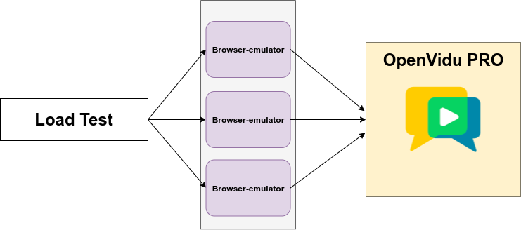

# OpenVidu Load Test

A distributed testing tool for performing load, stress and other performance tests against OpenVidu 3 deployments. Simulates realistic video conferencing scenarios with browser-emulated users.

# **Table of Contents**

1. [Quick Start](#quick-start)
   - [Run your first test with Docker Compose](#run-your-first-test-with-docker-compose)
   - [Large scale testing on AWS](#large-scale-testing-on-aws)
2. [Project Architecture](#project-architecture)
3. [Configuration](#configuration)
4. [Advanced Options](#advanced-options)

## **Quick Start**

### Run your first test with Docker Compose

We are going to launch a simple smoke test with 2 participants in a single session using Docker Compose. This is ideal for trying this tool, as well as verifying that the environment is set up correctly before running larger scale tests.

To start, you will need an OpenVidu deployment. You can use your own deployment, [or quickly start a local development installation](https://openvidu.io/latest/docs/self-hosting/local/).

Here's the configuration we will be using for this test. You can find it in `config/config.yaml`. Next, we will walk through the configuration file to understand each option.

```yaml
platform:
  url: https://your-openvidu-url.io:7443
  apiKey: devkey
  apiSecret: secret

testcases:
  - topology: N:N
    participants:
      - "2"
    sessions: 1
    browser: emulated

workers:
  urls: browser-emulator

distribution:
  usersPerWorker: 2
```

#### Configuration explanation

**platform**: Defines connection to the platform under test. You will have to set these options according to your OpenVidu deployment.

- `url`: Required. Points to the OpenVidu deployment. Note: If using a local OpenVidu deployment, make sure to set the platform URL in the next configuration file to the HTTPS endpoint indicated in `LiveKit Server API -> Access from other devices in your LAN:`.
- `apiKey` / `apiSecret`: Required. Credentials for authentication with the platform

**testcases**: Defines a list of the tests that will be done. It is required to add at least one test case. Our test will be performed with the following configuration:

- `topology: N:N`: All participants publish video/audio and subscribe to all other participants
- `participants: ["2"]`: Test with 2 participants per session. If more elements are added to the list, the test will be repeated with each of those values (e.g. 2, 8, 100... participants)
- `sessions: 1`: Create a single session with the number of participants established above. To create sessions until the platform fails, set this to `infinite`
- `browser: emulated`: Use user emulation, adding users to the platform without using real browsers. You can use real browsers changing this option to `chrome` or `firefox`. See [Choosing Emulated vs Real Browsers](#choosing-emulated-vs-real-browsers) for more information.

**workers**: Where the browsers run

- `urls: browser-emulator`: URL(s) of the workers to be used. Connect to the browser-emulator service running in Docker

**distribution**: How participants are distributed across workers

- `usersPerWorker: 2`: Each browser-emulator worker handles 2 participants maximum

### Run the test

To run the test, use the following command:

```bash
# Start all services with Docker Compose
docker compose up --build
```

The docker compose file will start two services:

- **Browser-emulator**: The worker that launches Chrome browsers to connect to rooms
- **Loadtest-controller**: Orchestrates the test by coordinating the browser-emulator

OpenVidu loadtest will execute the test cases and output results at `results/results.html`, you can open this file in a browser to see the results. You can also check the console output for real-time logs.

For more detailed instructions on how to configure tests, see [Configuration](#configuration).

### Large scale testing on AWS:

1. **Create browser-emulator AMI:**

   ```bash
   cd ./browser-emulator/aws/
   ./createAMI.sh --help
   ```

2. **Create security group** with at least port 5000 open.

3. **Configure** `config/config-aws.yaml`

## **Project Architecture**



- **Loadtest Controller**: Orchestrates the load test by coordinating browser-emulator workers. Reads configuration from `config/config.yaml` (see [Configuration](#configuration)).

- **Browser-emulator**: Worker service that connects to OpenVidu rooms, sending and receiving WebRTC media. Launches Chrome/Firefox browsers via Selenium.

## **Configuration**

The controller uses a YAML configuration file located in the `config` directory at the project root.

### Configuration File Location

- **Default**: `config/config.yaml`
- **Custom path**: Set `LOADTEST_CONFIG` environment variable

```bash
# Use a custom config file path
export LOADTEST_CONFIG=/path/to/my-config.yaml
```

When using Docker Compose, the `config` directory is mounted into the container, making it easy to edit configuration files on your host machine.

### Configuration Precedence

Environment variables override values in the config file:

```bash
export PLATFORM_URL=https://your-openvidu-url
export PLATFORM_APIKEY=your_api_key
export PLATFORM_APISECRET=your_api_secret
```

### Platform

Connection settings for the platform under test.

| Property    | Required | Default | Description                    |
| ----------- | -------- | ------- | ------------------------------ |
| `url`       | **Yes**  | -       | URL of the OpenVidu deployment |
| `apiKey`    | **Yes**  | -       | API key for authentication     |
| `apiSecret` | **Yes**  | -       | API secret for authentication  |

### Session

Naming and timing configuration for test sessions.

| Property                     | Required | Default           | Description                                 |
| ---------------------------- | -------- | ----------------- | ------------------------------------------- |
| `namePrefix`                 | No       | `LoadTestSession` | Prefix for session names                    |
| `usersNamePrefix`            | No       | `User`            | Prefix for participant names                |
| `secondsBetweenParticipants` | No       | `0`               | Seconds to wait between adding participants |
| `secondsBetweenSessions`     | No       | `0`               | Seconds to wait between sessions            |
| `secondsBetweenTestCases`    | No       | `0`               | Seconds to wait between test cases          |
| `secondsBeforeTestFinished`  | No       | `0`               | Seconds to wait before test ends            |

### Test Cases

Define multiple test scenarios that run sequentially. Each test case can have the following properties:

| Property                   | Required | Default   | Description                                                                                                                       |
| -------------------------- | -------- | --------- | --------------------------------------------------------------------------------------------------------------------------------- |
| `topology`                 | **Yes**  | -         | `N:N`, `N:M`, `TEACHING`, or `ONE_SESSION`                                                                                        |
| `participants`             | **Yes**  | -         | List of participant counts (e.g., `["2", "10"]`). Each element of the list will create a new test scenario                        |
| `sessions`                 | **Yes**  | -         | Number of sessions or `infinite`                                                                                                  |
| `browser`                  | No       | `chrome`  | Browser to use: `chrome`, `firefox`, or `emulated`. See [Choosing Emulated vs Real Browsers](#choosing-emulated-vs-real-browsers) |
| `resolution`               | No       | `640x480` | Try to force video to resolution: `640x480`, `1280x720`, `1920x1080`                                                              |
| `frameRate`                | No       | `30`      | Try to force video frame rate                                                                                                     |
| `startingParticipants`     | No       | `0`       | Adds a configurable initial batch of participants                                                                                 |
| `headlessBrowser`          | No       | `false`   | Run browser in headless mode. Only usable with real browsers.                                                                     |
| `browserRecording`         | No       | `false`   | Record browser output                                                                                                             |
| `showBrowserVideoElements` | No       | `true`    | Show video elements in browser. Only usable with real browsers.                                                                   |

**Topology Types:**

| Topology      | Description                            | Format   |
| ------------- | -------------------------------------- | -------- |
| `N:N`         | All participants publish and subscribe | `"10"`   |
| `N:M`         | N publishers, M subscribers            | `"5:50"` |
| `TEACHING`    | Publisher with audio-only subscribers  | `"2:30"` |
| `ONE_SESSION` | Single session with N participants     | `"100"`  |

### Choosing Emulated vs Real Browsers

An emulated user is a lightweight simulated participant implemented by the browser-emulator. It joins sessions and performs signaling while sending or receiving pre-recorded or synthetic media streams, but it does not run a full browser (no UI rendering or real device capture). Emulated users consume far less CPU and memory and start faster than real browser instances, making them suitable for large-scale load testing where browser-level behaviour is not required.

Decide between the `emulated` worker mode and real browsers based on the trade-off between scale and realism:

- **Use `emulated` when**:
  - You need to run very large-scale load or stress tests where resource efficiency is critical.
  - You primarily need to exercise signaling, session creation, and media forwarding rather than browser-specific rendering or UI behaviour.
  - Faster startup and lower CPU/memory usage per participant.
- **Limitations of `emulated`**:
  - Does not run a full browser; it won't reproduce browser-specific bugs, real media capture issues, record media for QoE analysis or get WebRTC stats.
- **Use real browsers (`chrome` / `firefox`) when**:
  - You need accurate end-to-end behaviour, QoE analysis, WebRTC stats or need to validate features that depend on actual browser APIs.
  - You are debugging issues that may be caused by rendering or browser implementation differences.

### Workers

Configuration for where browsers run. Workers can be manually provided and managed (Local workers) or automatically managed on AWS.

#### Common settings

| Property       | Required | Default | Description                |
| -------------- | -------- | ------- | -------------------------- |
| `disableHttps` | No       | `false` | Disable HTTPS verification |

#### Local Workers

| Property | Required | Default | Description                 |
| -------- | -------- | ------- | --------------------------- |
| `urls`   | **Yes**  | -       | Comma-separated worker URLs |

#### AWS Workers

| Property           | Required | Default      | Description                                                         |
| ------------------ | -------- | ------------ | ------------------------------------------------------------------- |
| `accessKey`        | **Yes**  | -            | AWS access key                                                      |
| `secretAccessKey`  | **Yes**  | -            | AWS secret access key                                               |
| `amiId`            | **Yes**  | -            | AMI ID for worker instances                                         |
| `instanceType`     | No       | `c5.xlarge`  | EC2 instance type                                                   |
| `keyPairName`      | No       | -            | EC2 key pair name                                                   |
| `securityGroupId`  | No       | -            | Security group ID                                                   |
| `region`           | No       | `us-east-1`  | AWS region                                                          |
| `availabilityZone` | No       | `us-east-1f` | AWS availability zone                                               |
| `workersAtStart`   | No       | `0`          | Number of instances to start the test with                          |
| `rampUpWorkers`    | No       | `0`          | Workers instances to add when the test runs out of existing ones    |
| `terminateWorkers` | No       | _true_       | Whether to terminate EC2 instances after test completion            |
| `exitOnEnd`        | No       | _true_       | Whether to signal workers to cleanup and exit after test completion |

### Distribution

How participants are distributed across workers.

| Property         | Required          | Default | Description                    |
| ---------------- | ----------------- | ------- | ------------------------------ |
| `usersPerWorker` | If `manual: true` | -       | Max number of users per worker |

### Video

Video source and quality settings. Note: these options will be ignored when using firefox, which does not support custom video sources.

| Property         | Required          | Default | Description                                                                                                                          |
| ---------------- | ----------------- | ------- | ------------------------------------------------------------------------------------------------------------------------------------ |
| `type`           | No                | `BUNNY` | Video type: `BUNNY`, `INTERVIEW`, `GAME`, `CUSTOM`. The first 3 options are pre-defined video sources provided by the OpenVidu team. |
| `width`          | No                | `640`   | Video width in pixels                                                                                                                |
| `height`         | No                | `480`   | Video height in pixels                                                                                                               |
| `fps`            | No                | `30`    | Frames per second                                                                                                                    |
| `customVideoUrl` | If `type: CUSTOM` | -       | URL to custom video file                                                                                                             |
| `customAudioUrl` | If `type: CUSTOM` | -       | URL to custom audio file                                                                                                             |

The predefined options available are:

- **BUNNY**:
  - Available resolutions: 640x480, 1280x720, 1920x1080
  - Available frame rates: 30fps, 60fps
- **INTERVIEW**:
  - Available resolutions: 640x480
  - Available frame rates: 30fps
- **GAME**:
  - Available resolutions: 640x480
  - Available frame rates: 30fps

### Monitoring

Kibana integration for metrics visualization. Expects Elastichsearch 9.x and Kibana 9.x.

| Property                 | Required | Default | Description            |
| ------------------------ | -------- | ------- | ---------------------- |
| `kibana.host`            | No       | -       | Kibana URL             |
| `elasticsearch.host`     | No       | -       | Elasticsearch URL      |
| `elasticsearch.username` | No       | -       | Elasticsearch username |
| `elasticsearch.password` | No       | -       | Elasticsearch password |

### Advanced User Management Options

Performance and retry settings.

| Property                                 | Required | Default         | Description                                                                                                                                                              |
| ---------------------------------------- | -------- | --------------- | ------------------------------------------------------------------------------------------------------------------------------------------------------------------------ |
| `advanced.retry.enabled`                 | No       | `true`          | Enable participant insertion retries on failure                                                                                                                          |
| `advanced.retry.times`                   | No       | `5`             | Number of retry attempts                                                                                                                                                 |
| `advanced.batches.enabled`               | No       | `true`          | Enable batch mode: Users will be inserted in batches                                                                                                                     |
| `advanced.batches.maxConcurrentRequests` | No       | `CPU cores + 1` | Max concurrent requests when in batch mode                                                                                                                               |
| `advanced.waitForCompletion`             | No       | `true`          | Wait for all participants in the batch to confirm insertion into the platform before inserting the next batch. Will wait for individual participants if `batches: false` |

### Report Output Configuration

Control which output formats are generated after test completion.

| Property                | Required | Default | Description                               |
| ----------------------- | -------- | ------- | ----------------------------------------- |
| `advanced.reportOutput` | No       | `html`  | Comma-separated list: `html` and/or `txt` |

### Environment Variables

All configuration values can be set via environment variables. Environment variables take precedence over config file values. Any configuration value can be overridden by an environment variable. Some examples are:

| Variable                | Description                 |
| ----------------------- | --------------------------- |
| `PLATFORM_URL`          | Platform URL                |
| `PLATFORM_APIKEY`       | API key                     |
| `PLATFORM_APISECRET`    | API secret                  |
| `WORKERS_URLS`          | Comma-separated worker URLs |
| `AWS_ACCESS_KEY`        | AWS access key              |
| `AWS_SECRET_ACCESS_KEY` | AWS secret key              |
| `STORAGE_BUCKET`        | S3 bucket for recordings    |

### Example Configurations

| File                     | Purpose                   |
| ------------------------ | ------------------------- |
| `config/config.yaml`     | Default configuration     |
| `config/config-all.yaml` | All configuration options |
| `config/config-aws.yaml` | Production AWS deployment |

## **Advanced Options**

See [Advanced Configuration Options](docs/advanced-options.md) for:

- QoE Analysis configuration
- Recording settings
- Custom video sources
- Storage configuration for saving recordings and raw statistics

---

# Acknowledgments

This work has been supported by the Regional Government of Madrid (Spain) (CM) through project EDGEDATA-CM (P2018/TCS-4499) co-funded by FSE & FEDER.
